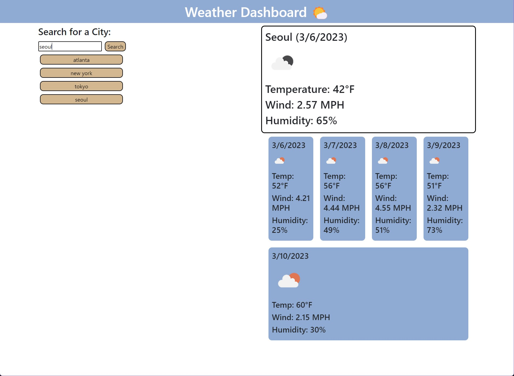

# Weather-Dashboard
Weather dashboard using server-side API's

## Description

This application was created as both a useful tool for checking the weather around the world, as well as a way of demonstrating how API's can be used when developing applications. Through the coding process, I learned how to read the data provided by the API via the console log, as well as navigate to my desired information and place it on my webpage. The biggest challenge through this process was correcting and dubugging errors, as well as correcting layout and data placement that was effected by coding my JavaScript file.

## Installation

To view this project, it required that a browser be installed on your preferred device. The browser can be any one of your choosing. To view, enter the following URL to the address bar of said browser:

https://tinathedev91.github.io/Weather-Dashboard/

## Usage

When viewing the website, it should resemble the following image. Included is a screenshot of how it should look in your desired web browser. If you have any issues viewing, please contact me via email at TinaTheDev91@gmail.com.

## Credits and Mentions

Thank you to my instructor Suarav for teaching us JavaScript fundamentals.

Thank you to my tutor, Jossy Olea with the assistance in debugging my code.